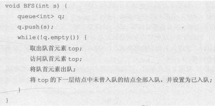
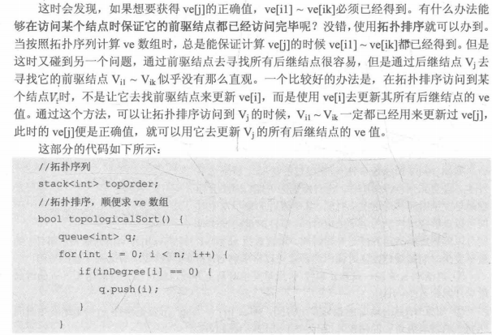

* 题解小细节

  * Java
  * Python3
  * C++

* 算法专项

  * 动态规划

    

    适用的情况：最优子结构+重叠子问题
    核心难点：状态转移方程+迭代得出最优解的写法

    

  * 状态机

    状态机的要素分为4个要素，即：现态、条件、动作、次态

    （1）现态：是指当前所处状态；
    （2）条件：又称为“事件”。当条件被满足时，将会触发一个动作，或者执行一次状态的迁移。
    （3）动作：条件满足后执行的动作。动作不是必须的，当条件满足后，也可以不执行任何动作，直接迁移到新状态。
    （4）次态：条件满足后要迁移往的新状态。“次态”是相对于“现态”而言的，“次态”一旦被激活，就转变成新的“现态”了
  
    如果要用到状态机，可以画出状态迁移图和状态迁移表，然后依照图表编程
  
    状态迁移图：
  
    状态迁移表：
  
    ```java
    力扣8. 字符串转换整数 (atoi)
    请你来实现一个 myAtoi(string s) 函数，使其能将字符串转换成一个 32 位有符号整数（类似 C/C++ 中的 atoi 函数）。
    函数 myAtoi(string s) 的算法如下：
        读入字符串并丢弃无用的前导空格
        检查下一个字符（假设还未到字符末尾）为正还是负号，读取该字符（如果有）。 确定最终结果是负数还是正数。 如果两者都不存在，则假定结果为正。
        读入下一个字符，直到到达下一个非数字字符或到达输入的结尾。字符串的其余部分将被忽略。
        将前面步骤读入的这些数字转换为整数（即，"123" -> 123， "0032" -> 32）。如果没有读入数字，则整数为 0 。必要时更改符号（从步骤 2 开始）。
        如果整数数超过 32 位有符号整数范围 [−231,  231 − 1] ，需要截断这个整数，使其保持在这个范围内。具体来说，小于 −231 的整数应该被固定为 −231 ，大于 231 − 1 的整数应该被固定为 231 − 1 。
        返回整数作为最终结果。
    示例：
    输入：s = "   -42"
    输出：-42
    
    class Solution {
        public int myAtoi(String str) {
            Automaton automaton = new Automaton();
            int length = str.length();
            for (int i = 0; i < length; ++i) {
                automaton.get(str.charAt(i));
            }
            return (int) (automaton.sign * automaton.ans);
        }
    }
    
    class Automaton {
        public int sign = 1;
        public long ans = 0;
        private String state = "start";
        private Map<String, String[]> table = new HashMap<String, String[]>() {{
            put("start", new String[]{"start", "signed", "in_number", "end"});
            put("signed", new String[]{"end", "end", "in_number", "end"});
            put("in_number", new String[]{"end", "end", "in_number", "end"});
            put("end", new String[]{"end", "end", "end", "end"});
        }};
    
        public void get(char c) {
            state = table.get(state)[get_col(c)];
            if ("in_number".equals(state)) {
                ans = ans * 10 + c - '0';
                ans = sign == 1 ? Math.min(ans, (long) Integer.MAX_VALUE) : Math.min(ans, -(long) Integer.MIN_VALUE);
            } else if ("signed".equals(state)) {
                sign = c == '+' ? 1 : -1;
            }
        }
    
        private int get_col(char c) {
            if (c == ' ') {
                return 0;
            }
            if (c == '+' || c == '-') {
                return 1;
            }
            if (Character.isDigit(c)) {
                return 2;
            }
            return 3;
        }
    }
    ```
  
  * 数学
  
    最大公约数与最小公倍数
  
    
  
    扩展欧几里得算法

    

    

    

    
  
    
  
    
  
    
  
    
  
  * 深度优先遍历
  
    深度优先遍历中，dfs函数必为递归并默认使用回溯法，主要包含返回值，参数，递归边界和递归条件，而其中返回值经常被忽略，递归条件也能够根据题意写出，但递归条件出错后却最不容易检查出哪里错了，最难写的是参数和递归边界。参数一般包含节点和深度，偶尔还会加上上限或者区间限制条件。
  
    深度优先遍历模板：
  
    
  
    
  
    
  
    
  
    
  
  * 广度优先遍历
  
    广度优先遍历较为简单，一般需要借助队列来实现。大多数情况下，广度优先遍历可以与深度优先遍历互相转换。
  
    广度优先遍历算法模版：
  
    
  
    需要计算层高时，可以在while循环刚开始时取得队列的长度大小，然后再写一个for循环，循环次数为队列的长度，在循环中进行出队和入队，最后在for循环完成后即可增加层高。
  
  * 贪心算法
  
    要想使用贪心算法，必须包括最优子结构，和每一步的选择都是最优的，并且不与后面的步骤共享资源。
  
    
  
  * 回溯
  
    回溯=递归+剪枝。
    回溯算法的基本思想是：从一条路往前走，能进则进，不能进则退回来，换一条路再试。回溯想不通时，画一颗递归树是很好的做法。
  
    ```java
    回溯法模板：
    private void backtrack("原始参数") {
        //终止条件(递归必须要有终止条件)
        if ("终止条件") {
            //一些逻辑操作（可有可无，视情况而定）
            return;
        }
    
        for (int i = "for循环开始的参数"; i < "for循环结束的参数"; i++) {
            //一些逻辑操作（可有可无，视情况而定）
    
            //做出选择
    
            //递归
            backtrack("新的参数");
            //一些逻辑操作（可有可无，视情况而定）
    
            //撤销选择
        }
    }
    ```
  
    回溯法经典问题：N皇后。如果N皇后不要中间的那些具体的排列，只要最终有几种，那么下面这种解法是一种模板，可以参考使用：
  
    
  
    
  
    ```java
    力扣473：
    你将得到一个整数数组 matchsticks ，其中 matchsticks[i] 是第 i 个火柴棒的长度。你要用 所有的火柴棍 拼成一个正方形。你 不能折断 任何一根火柴棒，但你可以把它们连在一起，而且每根火柴棒必须 使用一次 。
    如果你能使这个正方形，则返回 true ，否则返回 false 。
    示例:
    输入: matchsticks = [1,1,2,2,2]
    输出: true
    解释: 能拼成一个边长为2的正方形，每边两根火柴。
    
        public boolean makesquare(int[] nums) {
            int total = 0;
            //统计所有火柴的长度
            for (int num : nums) {
                total += num;
            }
            //如果所有火柴的长度不是4的倍数，直接返回false
            if (total == 0 || (total & 3) != 0)
                return false;
            //回溯
            return backtrack(nums, 0, total >> 2, new int[4]);
        }
    
        //index表示访问到当前火柴的位置，target表示正方形的边长，size是长度为4的数组，
        //分别保存正方形4个边的长度
        private boolean backtrack(int[] nums, int index, int target, int[] size) {
            if (index == nums.length) {
                //如果火柴都访问完了，并且size的4个边的长度都相等，说明是正方形，直接返回true，
                //否则返回false
                if (size[0] == size[1] && size[1] == size[2] && size[2] == size[3])
                    return true;
                return false;
            }
            //到这一步说明火柴还没访问完
            for (int i = 0; i < size.length; i++) {
                //如果把当前火柴放到size[i]这个边上，他的长度大于target，我们直接跳过
                if (size[i] + nums[index] > target)
                    continue;
                //如果当前火柴放到size[i]这个边上，长度不大于target，我们就放上面
                size[i] += nums[index];
                //然后在放下一个火柴，如果最终能变成正方形，直接返回true
                if (backtrack(nums, index + 1, target, size))
                    return true;
                //如果当前火柴放到size[i]这个边上，最终不能构成正方形，我们就把他从
                //size[i]这个边上给移除，然后在试其他的边
                size[i] -= nums[index];
            }
            //如果不能构成正方形，直接返回false
            return false;
        }
    ```
  
  * 图
  
    * 最短路径
  
      * Dijkstra算法
  
        
  
        
  
        
  
        
  
        
  
        
  
        
  
        
  
      * 最佳优先搜索
  
        与Dijkstra算法类似，我们也使用一个优先队列，但此时以每个节点到达终点的距离作为优先级，每次始终选取到终点移动代价最小（离终点最近）的节点作为下一个遍历的节点。这种算法称之为最佳优先（Best First）算法。
  
        ```python
        def heuristic(a, b):
           # Manhattan distance on a square grid
           return abs(a.x - b.x) + abs(a.y - b.y)
        
        frontier = PriorityQueue()
        frontier.put(start, 0)
        came_from = dict()
        came_from[start] = None
        
        while not frontier.empty():
           current = frontier.get()
        
           if current == goal:
              break
           
           for next in graph.neighbors(current):
              if next not in came_from:
                 priority = heuristic(goal, next)
                 frontier.put(next, priority)
                 came_from[next] = current
        ```
  
      * A*算法
  
        A*算法通过这个函数来计算每个节点的优先级：f(n)=g(n)+h(n)
  
        其中：f(n)是节点n的综合优先级。当我们选择下一个要遍历的节点时，我们总会选取综合优先级最高（值最小）的节点。g(n) 是节点n距离起点的代价。h(n)是节点n距离终点的预计代价，这也就是A*算法的启发函数。关于启发函数我们在下面详细讲解。
  
        A\*算法在运算过程中，每次从优先队列中选取f(n)值最小（优先级最高）的节点作为下一个待遍历的节点。另外，A\*算法使用两个集合来表示待遍历的节点，与已经遍历过的节点，这通常称之为open_set和close_set。
  
        完整的A*算法描述如下：
  
        ```python
        * 初始化open_set和close_set；
        * 将起点加入open_set中，并设置优先级为0（优先级最高）；
        * 如果open_set不为空，则从open_set中选取优先级最高的节点n：
            * 如果节点n为终点，则：
                * 从终点开始逐步追踪parent节点，一直达到起点；
                * 返回找到的结果路径，算法结束；
            * 如果节点n不是终点，则：
                * 将节点n从open_set中删除，并加入close_set中；
                * 遍历节点n所有的邻近节点：
                    * 如果邻近节点m在close_set中，则：
                        * 跳过，选取下一个邻近节点
                    * 如果邻近节点m也不在open_set中，则：
                        * 设置节点m的parent为节点n
                        * 计算节点m的优先级
                        * 将节点m加入open_set中
        def heuristic(a, b):
           # Manhattan distance on a square grid
           return abs(a.x - b.x) + abs(a.y - b.y)
                        
        frontier = PriorityQueue()
        frontier.put(start, 0)
        came_from = dict()
        cost_so_far = dict()
        came_from[start] = None
        cost_so_far[start] = 0
        
        while not frontier.empty():
           current = frontier.get()
        
           if current == goal:
              break
           
           for next in graph.neighbors(current):
              new_cost = cost_so_far[current] + graph.cost(current, next)
              if next not in cost_so_far or new_cost < cost_so_far[next]:
                 cost_so_far[next] = new_cost
                 priority = new_cost + heuristic(goal, next)
                 frontier.put(next, priority)
                 came_from[next] = current
        ```
  
        对于网格形式的图，有以下这些启发函数可以使用：
  
        * 如果图形中只允许朝上下左右四个方向移动，则可以使用曼哈顿距离（Manhattan distance）。
        * 如果图形中允许朝八个方向移动，则可以使用对角距离。
        * 如果图形中允许朝任何方向移动，则可以使用欧几里得距离（Euclidean distance）。
  
        ```python
        力扣675
        你被请来给一个要举办高尔夫比赛的树林砍树。树林由一个 m x n 的矩阵表示， 在这个矩阵中：
        0 表示障碍，无法触碰
        1 表示地面，可以行走
        比 1 大的数 表示有树的单元格，可以行走，数值表示树的高度
        每一步，你都可以向上、下、左、右四个方向之一移动一个单位，如果你站的地方有一棵树，那么你可以决定是否要砍倒它。
        你需要按照树的高度从低向高砍掉所有的树，每砍过一颗树，该单元格的值变为 1（即变为地面）。
        你将从 (0, 0) 点开始工作，返回你砍完所有树需要走的最小步数。 如果你无法砍完所有的树，返回 -1 。
        可以保证的是，没有两棵树的高度是相同的，并且你至少需要砍倒一棵树。
        示例：
        输入：[[1,2,7],[0,0,4],[3,6,5]]
        输出：14
        解释：沿着上面的路径，你可以用 14 步，按从最矮到最高的顺序砍掉这些树。
        
        
        class Solution {
        public:
            int dirs[4][2] = {{-1, 0}, {1, 0}, {0, -1}, {0, 1}};
        
            int bfs(vector<vector<int>>& forest, int sx, int sy, int tx, int ty) {
                if (sx == tx && sy == ty) {
                    return 0;
                }
        
                int row = forest.size();
                int col = forest[0].size();
                vector<vector<int>> costed(row, vector<int>(col, INT_MAX));
                priority_queue<tuple<int, int, int>, vector<tuple<int, int, int>>, greater<tuple<int, int, int>>> pq;
                costed[sx][sy] = abs(sx - tx) + abs(sy - ty);
                pq.emplace(costed[sx][sy], 0, sx * col + sy);
                while (!pq.empty()) {
                    auto [cost, dist, loc] = pq.top();
                    pq.pop();
                    int cx = loc / col;
                    int cy = loc % col;
                    if (cx == tx && cy == ty) {
                        return dist;
                    }
                    for (int i = 0; i < 4; ++i) {
                        int nx = cx + dirs[i][0];
                        int ny = cy + dirs[i][1];
                        if (nx >= 0 && nx < row && ny >= 0 && ny < col && forest[nx][ny] > 0) {
                            int ncost = dist + 1 + abs(nx - tx) + abs(ny - ty);
                            if (ncost < costed[nx][ny]) {
                                pq.emplace(ncost, dist + 1, nx * col + ny);
                                costed[nx][ny] = ncost;
                            }
                        }
                    }
                }
                return -1;
            }
        
            int cutOffTree(vector<vector<int>>& forest) {
                vector<pair<int, int>> trees;
                int row = forest.size();
                int col = forest[0].size();
                for (int i = 0; i < row; ++i) {
                    for (int j = 0; j < col; ++j) {
                        if (forest[i][j] > 1) {
                            trees.emplace_back(i, j);
                        }
                    }
                }
                sort(trees.begin(), trees.end(), [&](const pair<int, int> & a, const pair<int, int> & b) {
                    return forest[a.first][a.second] < forest[b.first][b.second];
                });
                
                int cx = 0;
                int cy = 0;
                int ans = 0;
                for (int i = 0; i < trees.size(); ++i) {
                    int steps = bfs(forest, cx, cy, trees[i].first, trees[i].second);
                    if (steps == -1) {
                        return -1;
                    }
                    ans += steps;
                    cx = trees[i].first;
                    cy = trees[i].second;
                }
                return ans;
            }
        };
        ```
      
      * Bellman-Ford算法&SPFA算法
      
        
      
        
      
        
      
        
      
        
      
        
      
        
      
        
      
      * Floyd算法
      
        
      
        
      
        
      
      * 最小生成树
      
        * Prim算法
      
        
      
        
      
        
      
        * Kruskal算法
      
        
      
        
      
        
      
      * 拓扑排序
      
        
      
        
      
      * 关键路径
      
        
      
        
      
        
      
        
      
        
      
        
      
        
      
        
      
        
  
  * 并查集
  
    操作模版
  
    初始化：
  
    路径压缩+找爸爸
  
    迭代写法：
  
    递归写法：
  
    合并两个集合：
  
  * 字符串
  
    * KMP
  
      
  
      
  
      
  
      
  
    * 前缀树
  
      前缀树（又称字典树）就是多叉树，树枝上对应相应的集合元素。
      
      ```java
      力扣678：
      现在，给定一个由许多词根组成的词典和一个句子。你需要将句子中的所有继承词用词根替换掉。如果继承词有许多可以形成它的词根，则用最短的词根替换它。
      你需要输出替换之后的句子。
      示例：
      输入：dictionary = ["a","b","c"], sentence = "aadsfasf absbs bbab cadsfafs"
      输出："a a b c"
          
          
      class Solution {
          public String replaceWords(List<String> roots, String sentence) {
              TrieNode trie = new TrieNode();
              for (String root: roots) {
                  TrieNode cur = trie;
                  for (char letter: root.toCharArray()) {
                      if (cur.children[letter - 'a'] == null)
                          cur.children[letter - 'a'] = new TrieNode();
                      cur = cur.children[letter - 'a'];
                  }
                  cur.word = root;
              }
      
              StringBuilder ans = new StringBuilder();
      
              for (String word: sentence.split("\\s+")) {//正则表达式在"\s+" 在Java中使用"\s+",因为反斜杠是转义字符。\s表示匹配任何空白字符，包括空格、制表符、换页符等等, 等价于[ \f\n\r\t\v]。而"\s+"则表示匹配任意多个上面的字符
                  if (ans.length() > 0)
                      ans.append(" ");
      
                  TrieNode cur = trie;
                  for (char letter: word.toCharArray()) {
                      if (cur.children[letter - 'a'] == null || cur.word != null)
                          break;
                      cur = cur.children[letter - 'a'];
                  }
                  ans.append(cur.word != null ? cur.word : word);
              }
              return ans.toString();
          }
      }
      
      class TrieNode {
          TrieNode[] children;
          String word;
          TrieNode() {
              children = new TrieNode[26];
          }
      }
      ```
  
  * 线段树
  
    * 线段树的建立
  
      线段树是一棵平衡二叉树。母结点代表整个区间的和，越往下区间越小。注意，线段树的每个节点都对应一条线段（区间），但并不保证所有的线段（区间）都是线段树的节点，这两者应当区分开。如果有一个数组[1,2,3,4,5]，那么它对应的线段树大概长这个样子：
  
      如果题目中给了具体的区间范围，我们根据该范围建立线段树。
  
        ```java
      public void buildTree(Node node, int start, int end) {
            // 到达叶子节点
            if (start == end) {
                node.val = arr[start];
                return ;
            }
            int mid = (start + end) >> 1;
            buildTree(node.left, start, mid);
            buildTree(node.right, mid + 1, end);
            // 向上更新
            pushUp(node);
        }
        // 向上更新
      private void pushUp(Node node) {
            node.val = node.left.val + node.right.val;
      }
        ```
      
      但是很多时候，题目中都没有给出很具体的范围，只有数据的取值范围，一般都很大，所以我们更常用的是「动态开点」，「动态开点」一般是在「更新」或「查询」的时候动态的建立节点，具体可见下面的更新和查询操作
  
    * 线段树的更新
  
      我们使用「懒惰标记」的方法，我们只需要更新到满足条件的区间即可，然后再给该区间对应的节点加一个懒惰标记，表示该节点所有对应的孩子节点都应该有此更新
  
      ```java
      class Node {
          // 左右孩子节点
          Node left, right;
          // 当前节点值
          int val;
          // 懒惰标记
          int add;
      }
      ```
  
      基于「动态开点」的前提，我们下推懒惰标记的时候，如果节点不存在左右孩子节点，那么我们就创建左右孩子节点
  
      先来实现下推懒惰标记的函数：
  
      ```java
      // leftNum 和 rightNum 表示左右孩子区间的叶子节点数量
      // 因为如果是「加减」更新操作的话，需要用懒惰标记的值✖️叶子节点的数量
      private void pushDown(Node node, int leftNum, int rightNum) {
          // 动态开点
          if (node.left == null) node.left = new Node();
          if (node.right == null) node.right = new Node();
          // 如果 add 为 0，表示没有标记
          if (node.add == 0) return ;
          // 注意：当前节点加上标记值✖️该子树所有叶子节点的数量
          node.left.val += node.add * leftNum;
          node.right.val += node.add * rightNum;
          // 把标记下推给孩子节点
          // 对区间进行「加减」的更新操作，下推懒惰标记时需要累加起来，不能直接覆盖
          node.left.add += node.add;
          node.right.add += node.add;
          // 取消当前节点标记
          node.add = 0;
      }
      ```
  
      下面来实现更新的函数：
  
      ```java
      public void update(Node node, int start, int end, int l, int r, int val) {
          // 找到满足要求的区间
          if (l <= start && end <= r) {
              // 区间节点加上更新值
              // 注意：需要✖️该子树所有叶子节点
              node.val += (end - start + 1) * val;
              // 添加懒惰标记
              // 对区间进行「加减」的更新操作，懒惰标记需要累加，不能直接覆盖
              node.add += val;
              return ;
          }
          int mid = (start + end) >> 1;
          // 下推标记
          // mid - start + 1：表示左孩子区间叶子节点数量
          // end - mid：表示右孩子区间叶子节点数量
          pushDown(node, mid - start + 1, end - mid);
          // [start, mid] 和 [l, r] 可能有交集，遍历左孩子区间
          if (l <= mid) update(node.left, start, mid, l, r, val);
          // [mid + 1, end] 和 [l, r] 可能有交集，遍历右孩子区间
          if (r > mid) update(node.right, mid + 1, end, l, r, val);
          // 向上更新
          pushUp(node);
      }
      ```
  
    * 线段树的查询(以求和为例)
  
      ```java
      // 在区间 [start, end] 中查询区间 [l, r] 的结果，即 [l ,r] 保持不变
      // 对于上面的例子，应该这样调用该函数：query(root, 0, 4, 2, 4)
      public int query(Node node, int start, int end, int l, int r) {
          // 区间 [l ,r] 完全包含区间 [start, end]
          // 例如：[2, 4] = [2, 2] + [3, 4]，当 [start, end] = [2, 2] 或者 [start, end] = [3, 4]，直接返回
          if (l <= start && end <= r) return node.val;
          // 把当前区间 [start, end] 均分得到左右孩子的区间范围
          // node 左孩子区间 [start, mid]
          // node 左孩子区间 [mid + 1, end]
          int mid = (start + end) >> 1, ans = 0;
          // 下推标记
          pushDown(node, mid - start + 1, end - mid);
          // [start, mid] 和 [l, r] 可能有交集，遍历左孩子区间
          if (l <= mid) ans += query(node.left, start, mid, l, r);
          // [mid + 1, end] 和 [l, r] 可能有交集，遍历右孩子区间
          if (r > mid) ans += query(node.right, mid + 1, end, l, r);
          // ans 把左右子树的结果都累加起来了，与树的后续遍历同理
          return ans;
      }
      ```
  
    ```java
    力扣729. 我的日程安排表 II
    实现一个 MyCalendar 类来存放你的日程安排。如果要添加的日程安排不会造成 重复预订 ，则可以存储这个新的日程安排。
    当两个日程安排有一些时间上的交叉时（例如两个日程安排都在同一时间内），就会产生 重复预订 。
    日程可以用一对整数 start 和 end 表示，这里的时间是半开区间，即 [start, end), 实数 x 的范围为，  start <= x < end 。
    实现 MyCalendar 类：
    MyCalendar() 初始化日历对象。
    boolean book(int start, int end) 如果可以将日程安排成功添加到日历中而不会导致重复预订，返回 true 。否则，返回 false 并且不要将该日程安排添加到日历中。
    示例：
    输入：
    ["MyCalendar", "book", "book", "book"]
    [[], [10, 20], [15, 25], [20, 30]]
    输出：
    [null, true, false, true]
    解释：
    MyCalendar myCalendar = new MyCalendar();
    myCalendar.book(10, 20); // return True
    myCalendar.book(15, 25); // return False ，这个日程安排不能添加到日历中，因为时间 15 已经被另一个日程安排预订了。
    myCalendar.book(20, 30); // return True ，这个日程安排可以添加到日历中，因为第一个日程安排预订的每个时间都小于 20 ，且不包含时间 20 。
    
    解法一：TreeMap，注意，以后如果遇见线段树不会做，直接往treemap考虑
    class MyCalendar {
        TreeMap<Integer, Integer> tm = new TreeMap<>();    
        public boolean book(int start, int end) {
            Integer prev = tm.floorKey(start), next = tm.ceilingKey(start);
            if ((prev == null || tm.get(prev) <= start) && (next == null || end <= next)) {
                tm.put(start, end);
                return true;
            }
            return false;
        }
    }
                         
    解法二：线段树动态开点
    class MyCalendar {
        class Node {
            // ls 和 rs 分别代表当前节点的左右子节点在 tr 的下标
            // val 代表当前节点有多少数
            // add 为懒标记
            int ls, rs, add, val;
        }
        int N = (int)1e9, M = 120010, cnt = 1;
        Node[] tr = new Node[M];
        void update(int u, int lc, int rc, int l, int r, int v) {
            if (l <= lc && rc <= r) {
                tr[u].val += (rc - lc + 1) * v;
                tr[u].add += v;
                return ;
            }
            lazyCreate(u);
            pushdown(u, rc - lc + 1);
            int mid = lc + rc >> 1;
            if (l <= mid) update(tr[u].ls, lc, mid, l, r, v);
            if (r > mid) update(tr[u].rs, mid + 1, rc, l, r, v);
            pushup(u);
        }
        int query(int u, int lc, int rc, int l, int r) {
            if (l <= lc && rc <= r) return tr[u].val;
            lazyCreate(u);
            pushdown(u, rc - lc + 1);
            int mid = lc + rc >> 1, ans = 0;
            if (l <= mid) ans = query(tr[u].ls, lc, mid, l, r);
            if (r > mid) ans += query(tr[u].rs, mid + 1, rc, l, r);
            return ans;
        }
        void lazyCreate(int u) {
            if (tr[u] == null) tr[u] = new Node();
            if (tr[u].ls == 0) {
                tr[u].ls = ++cnt;
                tr[tr[u].ls] = new Node();
            }
            if (tr[u].rs == 0) {
                tr[u].rs = ++cnt;
                tr[tr[u].rs] = new Node();
            }
        }
        void pushdown(int u, int len) {
            tr[tr[u].ls].add += tr[u].add; tr[tr[u].rs].add += tr[u].add;
            tr[tr[u].ls].val += (len - len / 2) * tr[u].add; tr[tr[u].rs].val += len / 2 * tr[u].add;
            tr[u].add = 0;
        }
        void pushup(int u) {
            tr[u].val = tr[tr[u].ls].val + tr[tr[u].rs].val;
        }
        public boolean book(int start, int end) {
            if (query(1, 1, N + 1, start + 1, end) > 0) return false;
            update(1, 1, N + 1, start + 1, end, 1);
            return true;
        }
    }                 
    ```
  
  * 树状数组
  
    
  
    黑色数组代表原来的数组（下面用A[i]代替），红色结构代表我们的树状数组(下面用C[i]代替)，发现没有，每个位置只有一个方框，令每个位置存的就是子节点的值的和，则有：
    C[1] = A[1];
    C[2] = A[1] + A[2];
    C[3] = A[3];
    C[4] = A[1] + A[2] + A[3] + A[4];
    C[5] = A[5];
    C[6] = A[5] + A[6];
    C[7] = A[7];
    C[8] = A[1] + A[2] + A[3] + A[4] + A[5] + A[6] + A[7] + A[8];
    可以发现，这颗树是有规律的
    C[i] = A[i - 2k+1] + A[i - 2k+2] + ... + A[i];   //k为i的二进制中从最低位到高位连续零的长度
    而根据上面的式子，容易的出SUMi = C[i] + C[i-2k1] + C[(i - 2k1) - 2k2] + .....；
    现在新的问题来了2^k该怎么求呢，不难得出2^k = i&(i^(i-1));但这个还是不好求出呀，前辈的智慧就出来了，2^k = i&(-i);
    而且这个有一个专门的称呼，叫做lowbit，即取2^k。
    上面已经解释了如何用树状数组求区间和，那么如果我们要更新某一个点的值呢，还是一样的，上面说了C[i] = A[i - 2k+1] + A[i - 2k+2] + ... + A[i]，那么如果我们更新某个A[i]的值，则会影响到所有包含有A[i]位置。如果求A[i]包含哪些位置里呢，同理有
    A[i] 包含于 C[i + 2k]、C[(i + 2k) + 2k]...；
  
    操作：
  
    ```java
    力扣327：
    给定一个整数数组 nums 。区间和 S(i, j) 表示在 nums 中，位置从 i 到 j 的元素之和，包含 i 和 j (i ≤ j)。
    请你以下标 i （0 <= i <= nums.length ）为起点，元素个数逐次递增，计算子数组内的元素和。
    当元素和落在范围 [lower, upper] （包含 lower 和 upper）之内时，记录子数组当前最末元素下标 j ，记作 有效 区间和 S(i, j) 。
    求数组中，值位于范围 [lower, upper] （包含 lower 和 upper）之内的 有效 区间和的个数。
    示例：
    输入：nums = [-2,5,-1], lower = -2, upper = 2,
    输出：3 
    解释：
    下标 i = 0 时，子数组 [-2]、[-2,5]、[-2,5,-1]，对应元素和分别为 -2、3、2 ；其中 -2 和 2 落在范围 [lower = -2, upper = 2] 之间，因此记录有效区间和 S(0,0)，S(0,2) 。
    下标 i = 1 时，子数组 [5]、[5,-1] ，元素和 5、4 ；没有满足题意的有效区间和。
    下标 i = 2 时，子数组 [-1] ，元素和 -1 ；记录有效区间和 S(2,2) 。
    故，共有 3 个有效区间和。
    ```
  
    
  
    ```java
    class Solution {
        public int countRangeSum(int[] nums, int lower, int upper) {
            long sum = 0;
            long[] preSum = new long[nums.length + 1];
            for (int i = 0; i < nums.length; ++i) {
                sum += nums[i];
                preSum[i + 1] = sum;
            }
            
            Set<Long> allNumbers = new TreeSet<Long>();
            for (long x : preSum) {
                allNumbers.add(x);
                allNumbers.add(x - lower);
                allNumbers.add(x - upper);
            }
            // 利用哈希表进行离散化
            Map<Long, Integer> values = new HashMap<Long, Integer>();
            int idx = 0;
            for (long x: allNumbers) {
                values.put(x, idx);
                idx++;
            }
    
            int ret = 0;
            BIT bit = new BIT(values.size());
            for (int i = 0; i < preSum.length; i++) {
                int left = values.get(preSum[i] - upper), right = values.get(preSum[i] - lower);
                ret += bit.query(right + 1) - bit.query(left);
                bit.update(values.get(preSum[i]) + 1, 1);
            }
            return ret;
        }
    }
    
    class BIT {
        int[] tree;
        int n;
    
        public BIT(int n) {
            this.n = n;
            this.tree = new int[n + 1];
        }
    
        public static int lowbit(int x) {
            return x & (-x);
        }
    
        public void update(int x, int d) {
            while (x <= n) {
                tree[x] += d;
                x += lowbit(x);
            }
        }
    
        public int query(int x) {
            int ans = 0;
            while (x != 0) {
                ans += tree[x];
                x -= lowbit(x);
            }
            return ans;
        }
    }
    ```
  
    