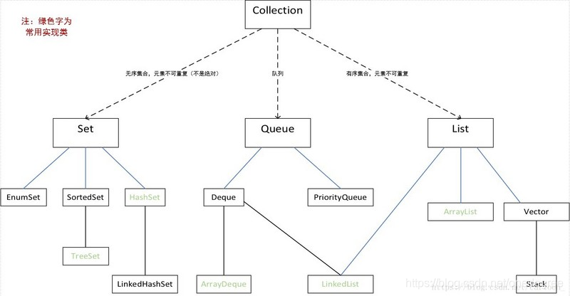

* C++

  * 如果题目限定了对应的指针，最好使用new（malloc）和delete（free）创建相应的空间；如果题目没有限定对应的指针，那么直接使用智能指针

    ```c++
    class Solution {
        shared_ptr<vector<string>> cache[100] = {nullptr};
    public:
        shared_ptr<vector<string>> generate(int n) {
            if (cache[n] != nullptr)
                return cache[n];
            if (n == 0) {
                cache[0] = shared_ptr<vector<string>>(new vector<string>{""});
            } else {
                auto result = shared_ptr<vector<string>>(new vector<string>);
                for (int i = 0; i != n; ++i) {
                    auto lefts = generate(i);
                    auto rights = generate(n - i - 1);
                    for (const string& left : *lefts)
                        for (const string& right : *rights)
                            result -> push_back("(" + left + ")" + right);
                }
                cache[n] = result;
            }
            return cache[n];
        }
        vector<string> generateParenthesis(int n) {
            return *generate(n);
        }
    };
    ```

  * 对于那些有顺序要求的问题，用map（红黑树）会更高效一些；对于查找问题，unordered_map（散列）会更加高效一些；也有set和unordered_set，unordered_map初始化如下

    ```c++
    unordered_map<char, string> phoneMap{
                {'2', "abc"},
                {'3', "def"},
                {'4', "ghi"},
                {'5', "jkl"},
                {'6', "mno"},
                {'7', "pqrs"},
                {'8', "tuv"},
                {'9', "wxyz"}
            };
    ```

  * lambda表达式写法示例

    ```c++
    class Solution {
    public:
        using LL = long long;
    
        struct Staff {
            int s, e;
            bool operator < (const Staff& rhs) const {
                return s > rhs.s;
            }
        };
    
        int maxPerformance(int n, vector<int>& speed, vector<int>& efficiency, int k) {
            vector<Staff> v;
            priority_queue<Staff> q;
            for (int i = 0; i < n; ++i) {
                v.push_back({speed[i], efficiency[i]});
            }
            sort(v.begin(), v.end(), [] (const Staff& u, const Staff& v) { return u.e > v.e; });
            LL ans = 0, sum = 0;
            for (int i = 0; i < n; ++i) {
                LL minE = v[i].e;
                LL sumS = sum + v[i].s;
                ans = max(ans, sumS * minE);
                q.push(v[i]); 
                sum += v[i].s;
                if (q.size() == k) {
                    sum -= q.top().s;
                    q.pop();
                }
            }
            return ans % (int(1E9) + 7);
        }
    };
    ```

  * INT_MIN和INT_MAX


* Java

  * 可变长字符串一般用StringBuilder，单线程速度快

  * Map初始化

    ```java
    Map<Character, String> phoneMap = new HashMap<Character, String>() {{
                put('2', "abc");
                put('3', "def");
                put('4', "ghi");
                put('5', "jkl");
                put('6', "mno");
                put('7', "pqrs");
                put('8', "tuv");
                put('9', "wxyz");
            }};
    ```

  * 多重容器初始化

    

    ```java
    List<List<Integer>> rg = new ArrayList<List<Integer>>();
    ```

    队列用法，一般用offer,peek,poll，也可做双端队列，如offerFirst,offerLast,peekFirst,peekLast,pollFirst,pollLast

    ```java
    Queue<Integer> queue = new LinkedList<Integer>();
    ```

  * 一般使用hashSet，TreeMap使用时注意这几个函数：firstKey,lastKey,ceilingKey,higherKey,descendingMap等

  * Java的map是否包含某个键：hash.containsKey(key)

    Java的map键遍历并得到值：for (String key :hash.keySet()) {hash.get(key);}

    Java将String转换为char[]并排序:char[] c = str.toCharArray();Arrays.sort(c);

    Java的map查找方法：返回值或者返回第二个参数：map.getOrDefault(x, 0)

    Java的sort方法重写：Arrays.sort(B, Comparator.comparingInt(Math::abs)); 

  * Integer.bitCount(k1 & Nones); // bitCount统计二进制中1的个数

    Integer.MAX_VALUE;//最大值

    Character.isDigit：判断字符是否为数字

* Javascript
  * 双端队列可以用shift,unshift,push,pop方法
  * javascript如何新建数组（n行m列）：const transposed = new Array(n).fill(0).map(() => new Array(m).fill(0));


* Python

  * py的join函数返回通过指定字符连接序列中元素后生成的新字符串。

    ```python
    #!/usr/bin/python
    # -*- coding: UTF-8 -*-
     
    str = "-";
    seq = ("a", "b", "c"); # 字符串序列
    print str.join( seq );
    ```

  * py的for in用法：经常用于遍历字符串、列表，元组，字典与迭代器等，还能直接生成列表

  * py的格式化字符串函数str.format()，它增强了字符串格式化的功能，基本语法是通过{}和:来代替以前的%

  * py3类型检查一般使用typing模块，关键字有int,long,float,bool,str,List, Tuple, Dict, Set,Iterable,Iterator,Generator

  * 语法糖：for _ in range(n)中_ 是占位符

  * deque类是python标准库collections模块中的一项，pop与popleft,append与appendleft,extendleft与extend；除此之外，还有queue模块，示例如下

    ```python
    import queue
    class MaxQueue:
    
        def __init__(self):
            self.deque = queue.deque()
            self.queue = queue.Queue()
    
        def max_value(self) -> int:
            return self.deque[0] if self.deque else -1
    
    
        def push_back(self, value: int) -> None:
            while self.deque and self.deque[-1] < value:
                self.deque.pop()
            self.deque.append(value)
            self.queue.put(value)
    
        def pop_front(self) -> int:
            if not self.deque:
                return -1
            ans = self.queue.get()
            if ans == self.deque[0]:
                self.deque.popleft()
            return ans
    ```

  * str.split(str="", num=string.count(str))；num -- 分割次数，默认为 -1, 即分隔所有。

  * py的排序：list.sort( key=None, reverse=False)；sorted(iterable, key=None, reverse=False)  ；key对应的都可以多级排序，如

    ```python
    new_para = sorted(para.items(), key=lambda x: (x[1], x[0]))
    # key仅仅支持一个参数，就无法实现两个参数之间的对比，采用cmp_to_key 函数，可以接受两个参数，将两个参数做处理
    from functools import cmp_to_key 
    L=[9,2,23,1,2]
     
    sorted(L,key=cmp_to_key(lambda x,y:y-x))
    输出：
    [23, 9, 2, 2, 1]
    # 可使用tuple依次排序，力扣937
    def reorderLogFiles(self, logs: List[str]) -> List[str]:
        def compare(log):
            a, b = log.split(" ", 1)
            return (0, b, a) if b[0].isalpha() else (1,)
        logs.sort(key = compare)
        return logs
    ```

  * infinty和-infinty

  * Python itertools.chain(*iterable)：chain函数参数加\*表示去除 iterable 里的内嵌 iterable，不加\*表示合并

  * py中的小根堆：heapq.heapify(q)；若要建大根堆，可以加负号。往里塞元素：heapq.heappush(q,1)；往外弹元素：heapq.heappop(q)；

  * python bisect模块的使用

    ```python
    import bisect
     
    L = [1,3,3,6,8,12,15]
    x = 3
     
    x_insert_point = bisect.bisect_left(L,x)　　#在L中查找x，x存在时返回x左侧的位置，x不存在返回应该插入的位置..这是3存在于列表中，返回左侧位置１
    print x_insert_point
     
    x_insert_point = bisect.bisect_right(L,x)  #在L中查找x，x存在时返回x右侧的位置，x不存在返回应该插入的位置..这是3存在于列表中，返回右侧位置３
     
    print x_insert_point
     
    x_insort_left = bisect.insort_left(L,x)  #将x插入到列表L中，x存在时插入在左侧
    print L
     
    x_insort_rigth = bisect.insort_right(L,x) #将x插入到列表L中，x存在时插入在右侧　　　　
     
    print L
    
    结果：
    1
    3
    [1, 3, 3, 3, 6, 8, 12, 15]
    [1, 3, 3, 3, 3, 6, 8, 12, 15]
    ```


  * zip() 函数用于将可迭代的对象作为参数，将对象中对应的元素打包成一个个元组，然后返回由这些元组组成的列表。

    ```python
    >>> a = [1,2,3]
    >>> b = [4,5,6]
    >>> c = [4,5,6,7,8]
    >>> zipped = zip(a,b)     # 打包为元组的列表
    [(1, 4), (2, 5), (3, 6)]
    >>> zip(a,c)              # 元素个数与最短的列表一致
    [(1, 4), (2, 5), (3, 6)]
    >>> zip(*zipped)          # 与 zip 相反，*zipped 可理解为解压，返回二维矩阵式
    [(1, 2, 3), (4, 5, 6)]
    ```

    